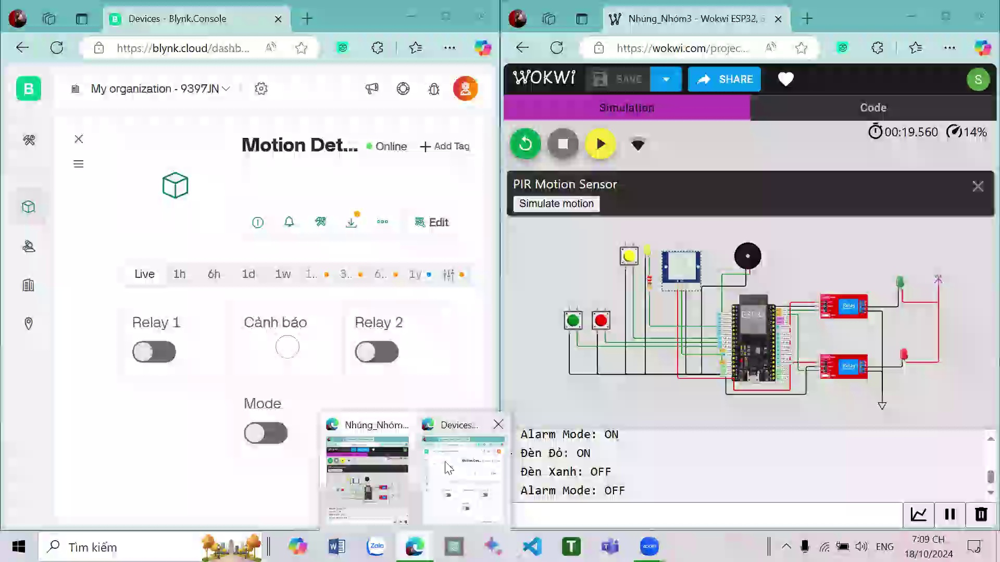
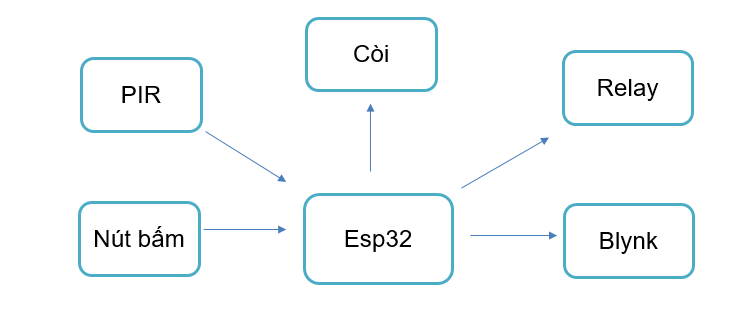
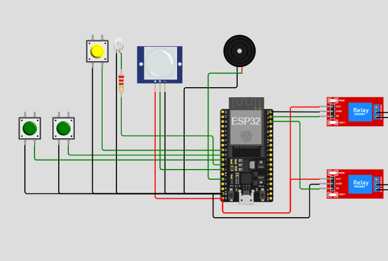
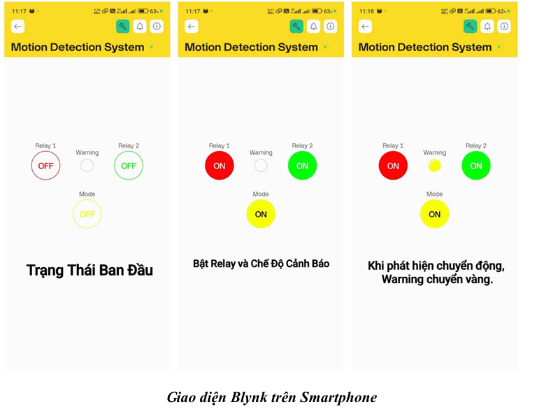
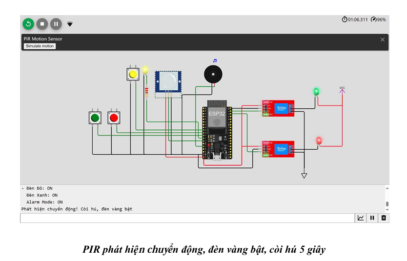
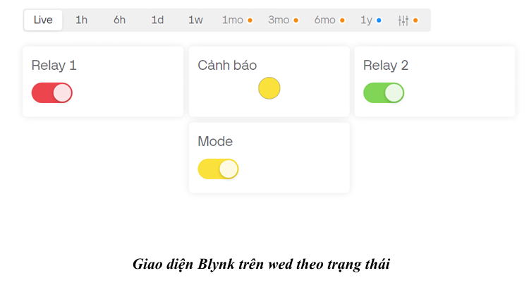
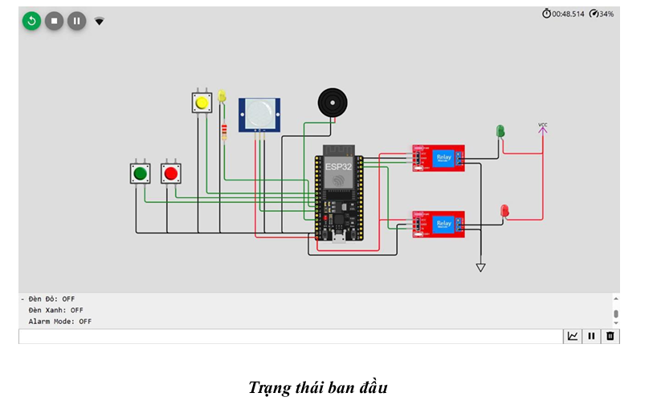
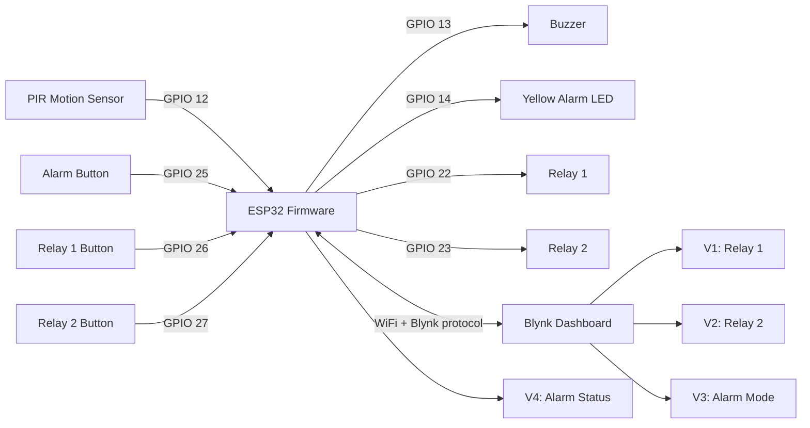

<a id="readme"></a>
<a href="#readme"></a>

# ESP32 Motion Detection & Remote Relay Control

An ESP32-based embedded IoT system for motion alarm and remote relay control.

<p>
  <a href="#readme"></a>
  <a href="#readme"></a>
  <a href="#readme"></a>
  <a href="#readme"></a>
  <a href="#readme"></a>
</p>

## <a name="preview"></a> Preview



> Course project for an Embedded Systems class. The system combines a PIR motion sensor, two relay outputs, local push buttons, LED/buzzer alarm feedback, and a Blynk dashboard for remote control.

## <a name="demo-gallery"></a> Demo Gallery

| System block diagram | Wokwi hardware model |
| --- | --- |
|  |  |

| Blynk mobile dashboard | PIR alarm simulation |
| --- | --- |
|  |  |

| Blynk web dashboard | Wokwi overview |
| --- | --- |
|  |  |

## <a name="table-of-contents"></a> Table of Contents

- [Preview](#preview)
- [Demo Gallery](#demo-gallery)
- [Project Highlights](#project-highlights)
- [Tech Stack](#tech-stack)
- [Features](#features)
- [System Architecture](#system-architecture)
- [Hardware Setup](#hardware-setup)
- [Blynk Virtual Pins](#blynk-virtual-pins)
- [Quick Start](#quick-start)
- [Project Structure](#project-structure)
- [Results & Metrics](#results--metrics)
- [Troubleshooting](#troubleshooting)
- [My Contribution](#my-contribution)
- [License](#license)

## <a name="project-highlights"></a> Project Highlights

- Implemented ESP32 firmware using Arduino C/C++ and the Blynk ESP32 library.
- Read PIR motion sensor input and triggered a buzzer plus yellow LED when alarm mode is active.
- Controlled two relay channels from both local push buttons and Blynk dashboard switches.
- Synchronized device states with Blynk virtual pins `V1`, `V2`, `V3`, and `V4`.
- Designed and simulated the circuit on Wokwi with ESP32, PIR sensor, relay modules, LEDs, buzzer, and buttons.
- Built a Blynk dashboard with relay switches, alarm mode control, and motion status display.
- Added Serial Monitor logging for relay states and alarm mode to support debugging.

## <a name="tech-stack"></a> Tech Stack

<a href="#tech-stack"></a>

| Area | Tools / Components |
| --- | --- |
| Microcontroller | ESP32 DevKit |
| Firmware | Arduino C/C++ |
| IoT Dashboard | Blynk Cloud |
| Simulation | Wokwi |
| Sensors | PIR motion sensor |
| Actuators | 2 relay modules, buzzer, LED indicators |
| Debugging | Serial Monitor at `115200` baud |

## <a name="features"></a> Features

- **Motion alarm mode:** PIR detection activates buzzer and yellow LED only when alarm mode is enabled.
- **Remote relay control:** Relay 1 and Relay 2 can be switched from Blynk dashboard.
- **Physical control fallback:** Three local buttons control alarm mode, Relay 1, and Relay 2.
- **State synchronization:** Local button changes are pushed back to Blynk so the dashboard remains consistent.
- **Periodic monitoring:** PIR state is checked every `1000 ms` using `BlynkTimer`.
- **Simple debounce:** Button handling includes a `300 ms` delay to reduce repeated toggles.

## <a name="system-architecture"></a> System Architecture



The firmware keeps the logic simple: Blynk handles remote commands, local buttons provide direct control, and the PIR alarm routine only runs when `alarmMode` is enabled.

## <a name="hardware-setup"></a> Hardware Setup

| Component | ESP32 Pin | Purpose |
| --- | --- | --- |
| PIR motion sensor | `GPIO 12` | Motion detection input |
| Buzzer | `GPIO 13` | Audible alarm |
| Yellow LED | `GPIO 14` | Alarm indicator |
| Relay 1 | `GPIO 22` | Output channel 1 |
| Relay 2 | `GPIO 23` | Output channel 2 |
| Alarm mode button | `GPIO 25` | Toggle alarm mode |
| Relay 1 button | `GPIO 26` | Toggle Relay 1 |
| Relay 2 button | `GPIO 27` | Toggle Relay 2 |

Wokwi simulation files are included in [`diagram.json`](diagram.json), [`sketch.ino`](sketch.ino), and [`libraries.txt`](libraries.txt).

Simulation link:

```text
https://wokwi.com/projects/411967425664926721
```

## <a name="blynk-virtual-pins"></a> Blynk Virtual Pins

| Virtual Pin | Direction | Function |
| --- | --- | --- |
| `V1` | App to ESP32 / ESP32 to App | Relay 1 state |
| `V2` | App to ESP32 / ESP32 to App | Relay 2 state |
| `V3` | App to ESP32 / ESP32 to App | Alarm mode |
| `V4` | ESP32 to App | Alarm active indicator |

## <a name="quick-start"></a> Quick Start

1. Clone the repository.

```bash
git clone https://github.com/lesongthao/esp32-motion-relay-blynk.git
cd esp32-motion-relay-blynk
```

2. Open `sketch.ino` in Arduino IDE, VS Code with PlatformIO, or Wokwi.

3. Install the required library.

```text
BlynkESP32_BT_WF
```

4. Replace the Blynk token in `sketch.ino`.

```cpp
#define BLYNK_AUTH_TOKEN "YOUR_BLYNK_AUTH_TOKEN"
```

5. Configure WiFi for real hardware, or keep Wokwi defaults for simulation.

```cpp
char ssid[] = "Wokwi-GUEST";
char pass[] = "";
```

6. Upload to ESP32 or run the Wokwi simulation.

```text
https://wokwi.com/projects/411967425664926721
```

## <a name="project-structure"></a> Project Structure

```text
.
|-- sketch.ino                 # Main ESP32 firmware for Wokwi/Arduino
|-- Code.txt                   # Source copy from the original assignment
|-- diagram.json               # Wokwi circuit definition
|-- libraries.txt              # Wokwi library list
|-- wokwi-project.txt          # Wokwi project note
|-- docs/
|   `-- images/
|       |-- demo-preview.jpg          # Preview image extracted from the demo video
|       |-- system-block-diagram.png  # System block diagram from the slide deck
|       |-- wokwi-hardware-model.png  # Wokwi circuit overview
|       |-- blynk-mobile-dashboard.png
|       |-- pir-alarm-simulation.png
|       |-- blynk-web-dashboard.png
|       `-- wokwi-overview.png
|-- .gitignore
`-- README.md
```

## <a name="results--metrics"></a> Results & Metrics

- Controlled **2 relay channels** through both physical buttons and Blynk dashboard switches.
- Synchronized **4 Blynk virtual pins** for relay state, alarm mode, and alarm activity feedback.
- Checked PIR motion every **1000 ms** using `BlynkTimer` to keep the main loop responsive.
- Triggered audible/visual alarm feedback for **5 seconds** after motion detection in alarm mode.
- Reduced accidental repeated button toggles with a **300 ms** software debounce delay.
- Documented the project with **6 visual artifacts** extracted from the report/slide deck: block diagram, hardware model, Blynk dashboards, and PIR simulation.

## <a name="troubleshooting"></a> Troubleshooting

| Issue | Possible Cause | Fix |
| --- | --- | --- |
| ESP32 cannot connect to Blynk | Invalid auth token or WiFi settings | Replace `YOUR_BLYNK_AUTH_TOKEN` and check `ssid` / `pass` |
| Blynk switches do not update | Wrong virtual pin mapping | Use `V1`, `V2`, `V3`, and `V4` as defined above |
| PIR alarm does not trigger | Alarm mode is off | Enable alarm mode from button `GPIO 25` or Blynk `V3` |
| Relay works in reverse | Relay module active-low behavior | Invert the `HIGH` / `LOW` logic for the relay output |
| Button toggles multiple times | Mechanical bounce | Increase the debounce delay or implement non-blocking debounce |

## <a name="my-contribution"></a> My Contribution

- Built and configured the Blynk dashboard for remote relay and alarm control.
- Prepared project documentation and presentation materials for the course assignment.
- Verified the control flow between Wokwi simulation, Blynk dashboard, and Serial Monitor logs.

## <a name="license"></a> License

This repository is prepared as an academic portfolio project. Add a license file before reusing the code in another public project.
